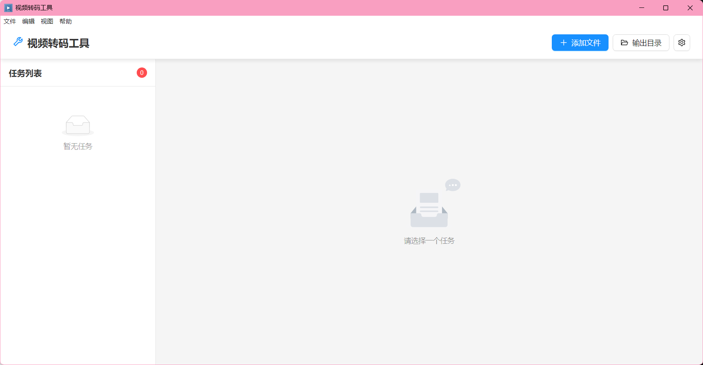

# 视频转码工具 (Video Transcoder)

<div align="center">
  
  
  [](https://opensource.org/licenses/MIT)
  [](https://www.electronjs.org/)
  [](https://reactjs.org/)
  [](https://www.typescriptlang.org/)
  
  <h3>基于 FFmpeg 的专业视频转码桌面应用</h3>
  <p>为用户打造的便捷视频处理工具</p>
</div>

## ✨ 特性

- 🎬 **多格式支持** - 支持几乎所有主流视频格式转换
- 🚀 **硬件加速** - 支持 NVIDIA NVENC、AMD AMF、Intel QSV 硬件加速
- 📊 **实时预览** - 转码进度实时显示，支持暂停/恢复
- 🎯 **预设管理** - 内置多种优化预设，支持自定义保存
- 🎨 **现代化界面** - 基于 Ant Design 的美观易用界面
- 💾 **批量处理** - 支持多文件批量转码任务队列

## 🖥️ 界面预览

<div align="center">
  
</div>

## 🛠️ 技术栈

- **前端框架**: React 18 + TypeScript
- **桌面框架**: Electron 27
- **UI 组件库**: Ant Design 5
- **视频处理**: FFmpeg (fluent-ffmpeg)
- **构建工具**: Webpack 5 + electron-builder
- **数据可视化**: Recharts

## 📦 安装

### 下载预编译版本

从 [Releases](https://github.com/zsbooody/Video-Transcoder/releases) 页面下载最新版本。

### 从源码构建

```bash
# 克隆仓库
git clone https://github.com/zsbooody/Video-Transcoder.git
cd Video-Transcoder

# 安装依赖
npm install

# 开发模式运行
npm run dev

# 构建应用
npm run dist:win  # Windows
npm run dist:mac  # macOS
npm run dist:linux  # Linux
```

## 🚀 使用指南

### 基础转码

1. 点击"选择文件"按钮或拖拽视频文件到应用窗口
2. 选择输出格式和编码预设
3. 点击"开始转码"按钮
4. 等待转码完成

### 硬件加速

应用会自动检测可用的硬件加速选项：
- **NVIDIA GPU**: 使用 NVENC 编码器
- **AMD GPU**: 使用 AMF 编码器
- **Intel GPU**: 使用 QSV 编码器

如果硬件加速失败，会自动回退到软件编码。

### 编码预设

- **ultrafast**: 最快速度，文件较大
- **fast**: 快速编码，平衡选择
- **medium**: 默认设置，质量与速度平衡
- **slow**: 较慢速度，更好质量
- **veryslow**: 最佳质量，速度最慢

## 🔧 配置要求

### 最低配置
- 操作系统: Windows 10 / macOS 10.13 / Ubuntu 18.04
- 处理器: 双核 2.0 GHz
- 内存: 4 GB RAM
- 存储: 1 GB 可用空间

### 推荐配置
- 操作系统: Windows 11 / macOS 12 / Ubuntu 22.04
- 处理器: 四核 3.0 GHz 或更高
- 内存: 8 GB RAM 或更多
- 显卡: 支持硬件编码的独立显卡
- 存储: SSD 硬盘，10 GB 可用空间

## 🤝 贡献

欢迎提交 Pull Request 或创建 Issue！

### 开发指南

1. Fork 本仓库
2. 创建功能分支 (`git checkout -b feature/AmazingFeature`)
3. 提交更改 (`git commit -m 'Add some AmazingFeature'`)
4. 推送到分支 (`git push origin feature/AmazingFeature`)
5. 创建 Pull Request

### 代码规范

- 使用 TypeScript 严格模式
- 遵循 ESLint 配置
- 组件使用函数式写法
- 提交信息遵循 Conventional Commits

## 📝 许可证

本项目采用 MIT 许可证 - 查看 [LICENSE](LICENSE) 文件了解详情。

## 🙏 致谢

### 项目愿景

这个项目致力于为用户提供一个简单易用、功能强大的视频转码工具。我们相信好的软件应该让复杂的技术变得简单，让每个人都能轻松处理视频文件。

### 开源项目

- [FFmpeg](https://ffmpeg.org/) - 强大的多媒体处理框架
- [Electron](https://www.electronjs.org/) - 跨平台桌面应用框架
- [React](https://reactjs.org/) - 用户界面构建库
- [Ant Design](https://ant.design/) - 企业级 UI 设计语言

## 📧 联系方式

- 项目主页: [https://github.com/zsbooody/Video-Transcoder](https://github.com/zsbooody/Video-Transcoder)
- Issue 反馈: [https://github.com/zsbooody/Video-Transcoder/issues](https://github.com/zsbooody/Video-Transcoder/issues)

---

<div align="center">
  Made with ❤️ for users
</div> 